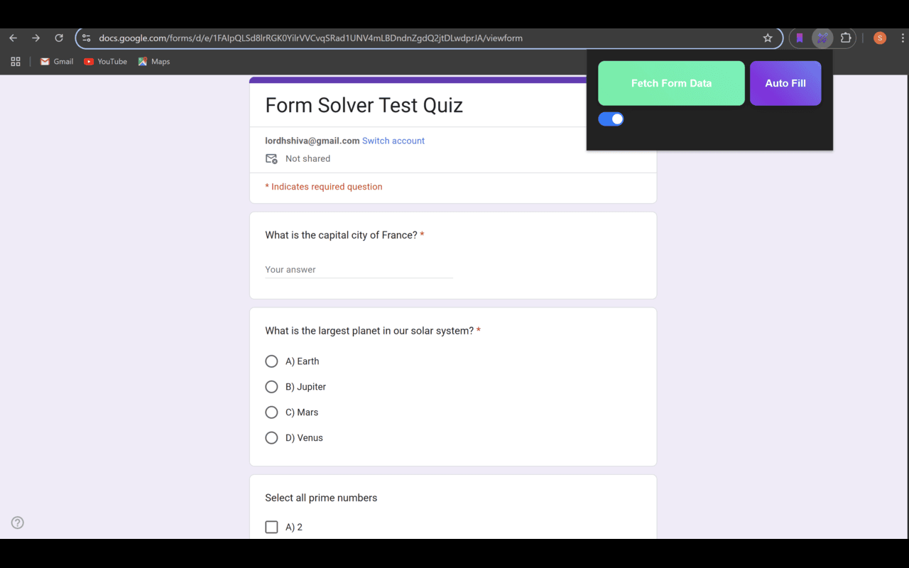
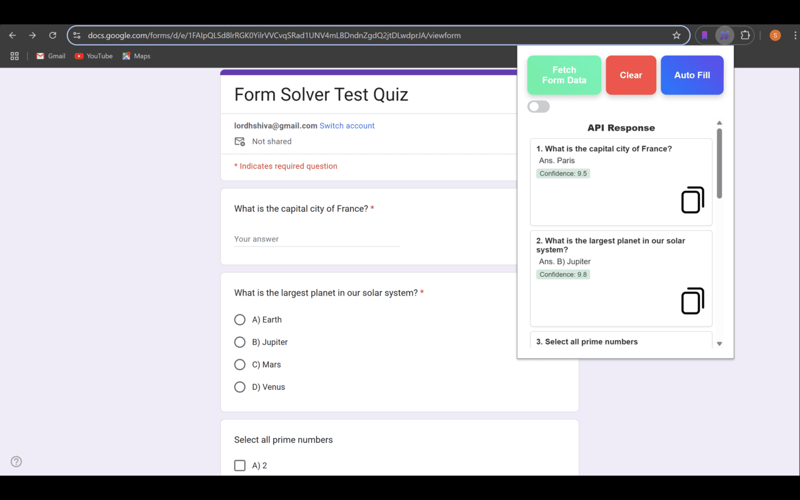
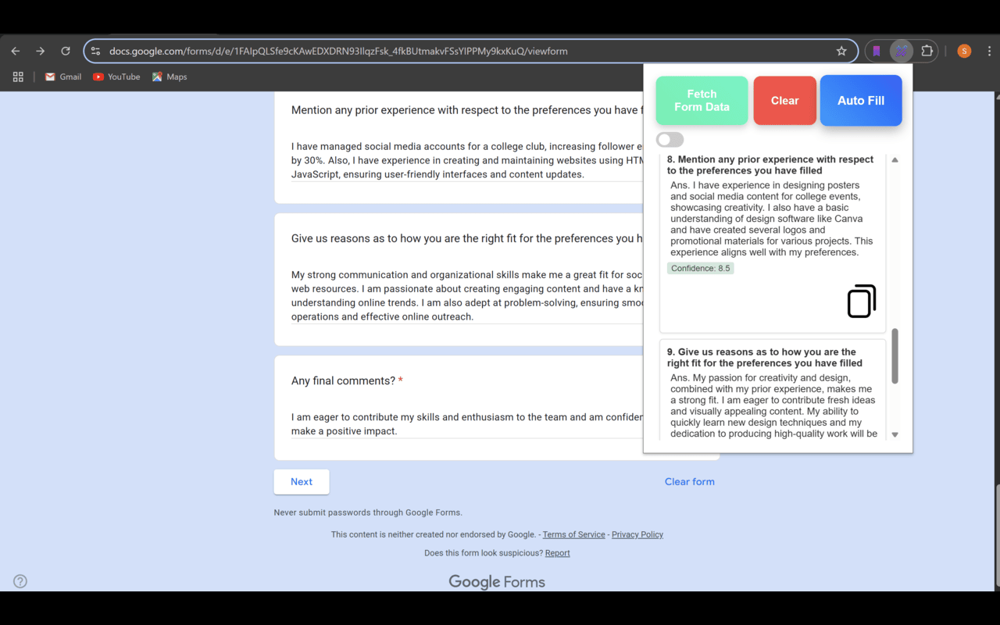
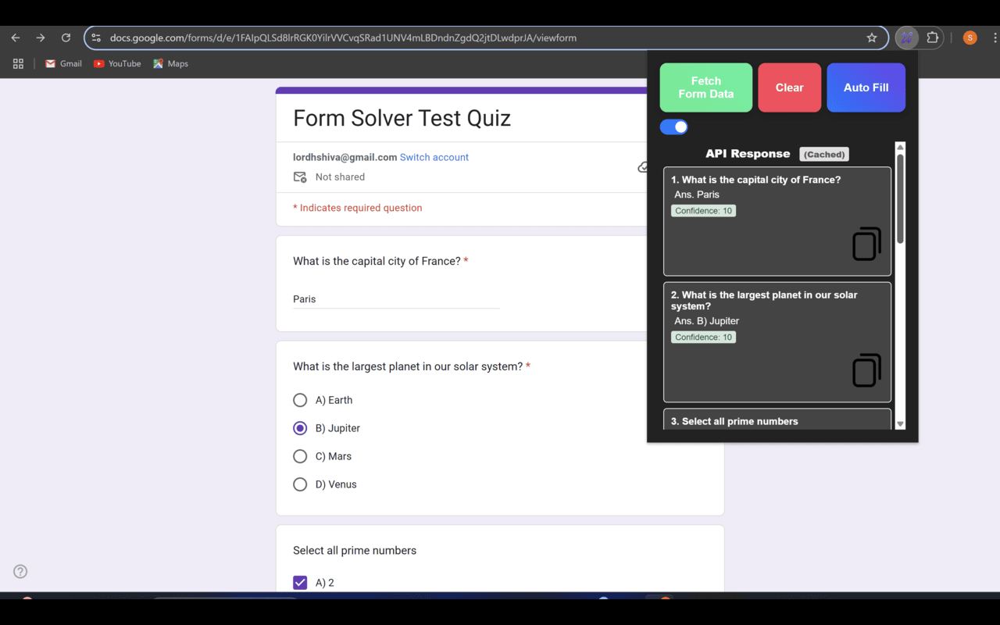
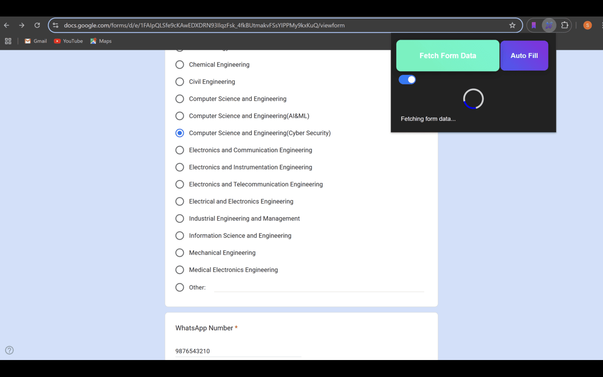
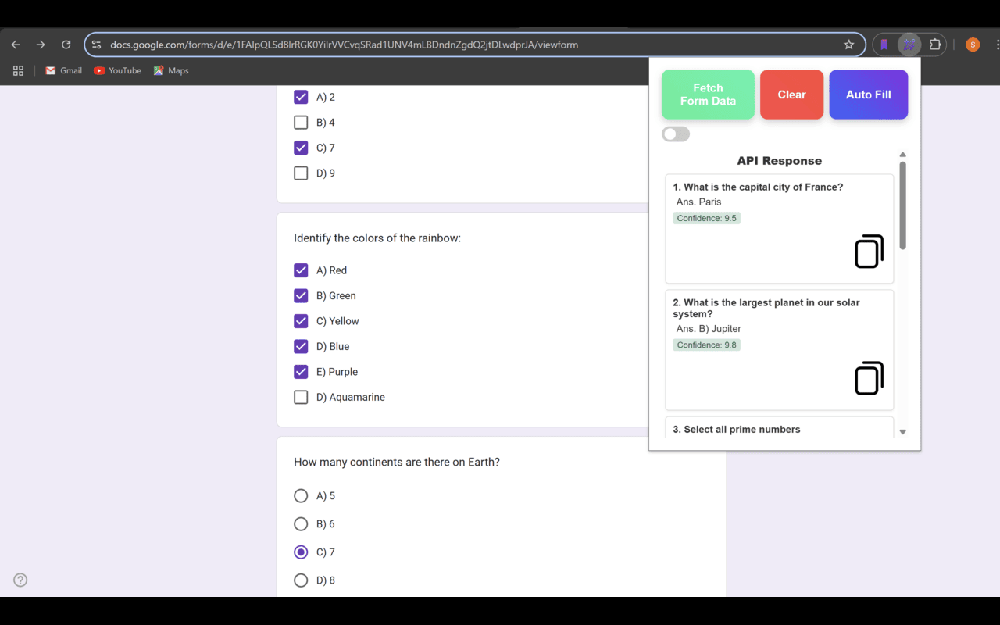

<div align="center">

# **Google Form AI Response with OCR detection - Chrome Extension** 🌐

*An efficient, enhanced tool to scan Google Form questions, retrieve options, and process them for lightning-fast answer generation—complete with advanced OCR, batching and pipeline mimicking, multi-language support, and caching!*

</div>

## Preview

<div align="center">
  
  
  
  <br>
  
  
  
</div>

---

## Features 📋

- **Free & Fast**  
  - 100% free – no hidden costs  
  - Autofill forms in as little as 2.6 seconds using an efficient batch processing system

- **Advanced AI & Image Processing**  
  - Powered by the fine-tuned Gemini 2.0 Flash model for highly accurate answers and multilingual support  
  - Cutting-edge OCR extracts text from images in multiple languages (Hindi, Tamil, Kannada, Malayalam, Telugu, etc.) and preserves mathematical formulas perfectly

- **Robust Caching & Reliability**  
  - Oops! Closed your form? Don’t worry—answers are cached, so they’re ready the next time you open it  
  - Never lose your data—your work remains safe and accessible

- **Stealth Keystroke Shortcuts**  
  - Afraid of opening a popup in front of a teacher? Use Alt+A to fetch form data discreetly  
  - Use Alt+C to trigger autofill instantly

- **Efficient Batching System**  
  - Automatically splits large forms (60+ questions) into smaller batches for rapid, error-free processing without exceeding token limits

- **User-Friendly Interface**  
  - Supports both light and dark modes for a comfortable viewing experience  
  - Clean, minimal design perfect for students and busy professionals

## Why This Extension?

- Greater accuracy with a fine-tuned model  
- Faster autofill through advanced batching  
- Superior OCR for math formulas and multi-language support  
- Reliable auto-caching keeps your data safe  
- Stealth keystroke shortcuts help you work discreetly

It’s built to save you time and reduce stress, making it the all-in-one solution for complex Google Forms.

## Technologies Used 🔧

- **Frontend**  
    
    
  

- **Backend**  
    
    
  

## Getting Started 🚀

1. **Clone the Repository**  
   ```bash
   git clone https://github.com/harshendram/GoogleFormFiller-with-OCR-and-Gemini.git
   cd GoogleFormFiller-with-OCR-and-Gemini
   ```

2. **Install Dependencies**  
   ```bash
   npm install
   ```

3. **Run the Backend**  
   ```bash
   npm start
   ```
   *(Adjust commands if needed, e.g. `node src/server.js`.)*

## Loading the Extension Locally

1. **Open the Chrome Extensions Page**  
   Go to `chrome://extensions/`

2. **Enable Developer Mode**  
   Toggle the **Developer mode** on (usually top-right corner).

3. **Load the Unpacked Extension**  
   Click **Load unpacked** and select the folder containing `manifest.json`.

## Contributing

For contribution guidelines, please see our [CONTRIBUTING.md](CONTRIBUTING.md).

## Contact 📬

For any questions or support, feel free to reach out at [harshendra16@gmail.com](mailto:harshendra16@gmail.com).

<div align="center">
Made with ❤️ by [@harshendram](https://github.com/harshendram)
</div>
